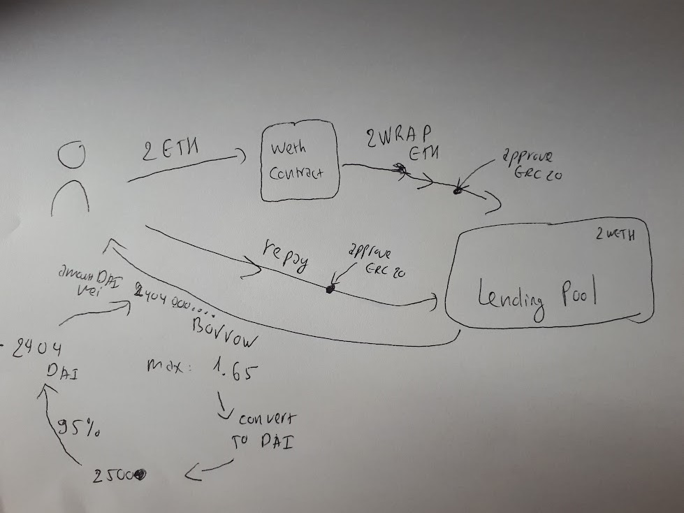

# Hardhat Defi



# Weth (Wrapped Ether)
### What is Weth?
This website explains the Weth contract: 
https://weth.io/

Check the file `scripts/getWeth.ts` for the implemenation and explanation of deposit ETH.

# Aave v2 

Check the file `scripts/aaveBorrow.ts` for implematation and explanation of deposit, borrow and repay.


# Some command lines used in the project

### Install dependencies
```shell
yarn
```

### Compile the contracts

```shell
yarn hardhat compile
```

### Run the aaveBorrow.ts script

```shell
yarn hardhat run scripts/aaveBorrow.ts
```
